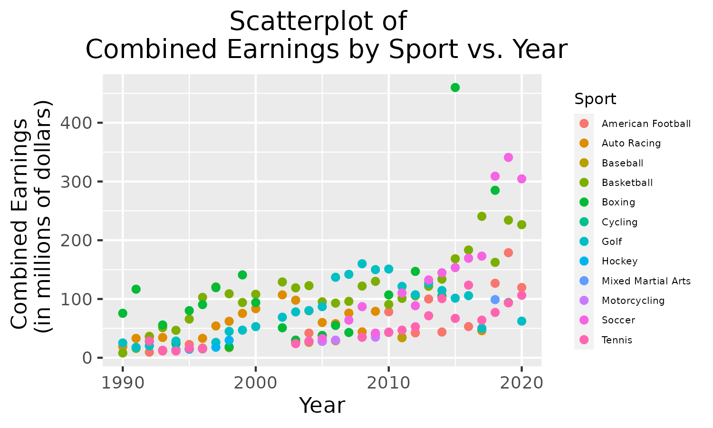

# Analysis of Forbes' Lists of Richest Athletes from 1990 to 2020
  
  Forbes magazine has produced and published a list of the richest professional athletes since 1990. The list ranks the athletes, across all sports, in terms of their yearly income and provides other information about each athlete. Among this information is the athlete's respective sport, their total income, and, added more recently, a break down of the athlete's income. In the lists of recent years, the athlete's earnings on the field and off the field have also been reported.
  
  The income year that the Forbes list reports on lasts from June until June. This is a change from how it was compiled when the list was first produced. The reporting period was originally the calendar year. The switch was made in 2002, making it so that there is no list for the 2001 year.

## Introduction

  The data I have chosen gives a summary of these lists produced by Forbes. For the years between 1990 and 2020, the data includes information about the ranks of the athletes by income for the year, their rank the previous year, the names of the athletes, the athletes' income for the year, and the athletes' nationalities.
  
  From this data, I have several questions. A few of them are: How do professional athletes’ salaries compare to one another? What trends are there among them? Is an athlete’s home country related to how much they are paid? How has the salary of the highest paid athlete has changed over time? Which athlete has appeared the most on the list? Can the highest paid athletes in a particular sport be grouped together in terms of amount of money earned? Which sports are consistently producing the highest paid athlete each year?
  
  I will answer a few of these questions in the analysis that I conduct on this data and leave the rest for future investigation.

## Exploratory Data Analysis

* To answer the question of which sports are consistently producing the highest paid athlete each year, I chose to make a histogram of the sports represented by those athletes ranked number 1 each year from 1990 to 2020. From this plot, we see that golf has produced the number 1 richest athlete more than 9 times out of the 30 years represented. This was surprising to me as I was not aware of the average annual salary for a golf player. Recently, soccer players like Cristiano Ronaldo and Lionel Messi have been in the news for their high salaries. This led me to believe that soccer would produce many of the number 1 richest athletes, however, from this plot we can see that soccer only produced less than 3 of the number 1 richest athletes from 1990 to 2020.

* Following my investigation of the sports that were producing the number 1 highest paid athlete each year, I went on to look at which athletes were consistently at the top of the Forbes list each year. As we can see from this histogram, Tiger Woods made the most appearances at the top of the Forbes List for Richest Athletes between the years of 1990 and 2020. Tiger Woods topped the list for 10 consecutive years from 2002 to 2011. Following Tiger Woods is UNC's very own, Michael Jordan. Michael Jordan topped the list for 4 consecutive years from 1992 to 1995.

* To answer the question of how the salaries of the richest paid athletes have changed over time, I chose to make a scatter plot of the athletes' earnings vs. the year. From this plot, we can see a subtle increasing trend of the salaries of the richest athletes over time. This was what I expected. As sports become increasingly popular entertainment worldwide and athletes begin to make money off the court through brand deals and other means, this trend is justifiable.

## Principal Components Analysis

## Future Analysis